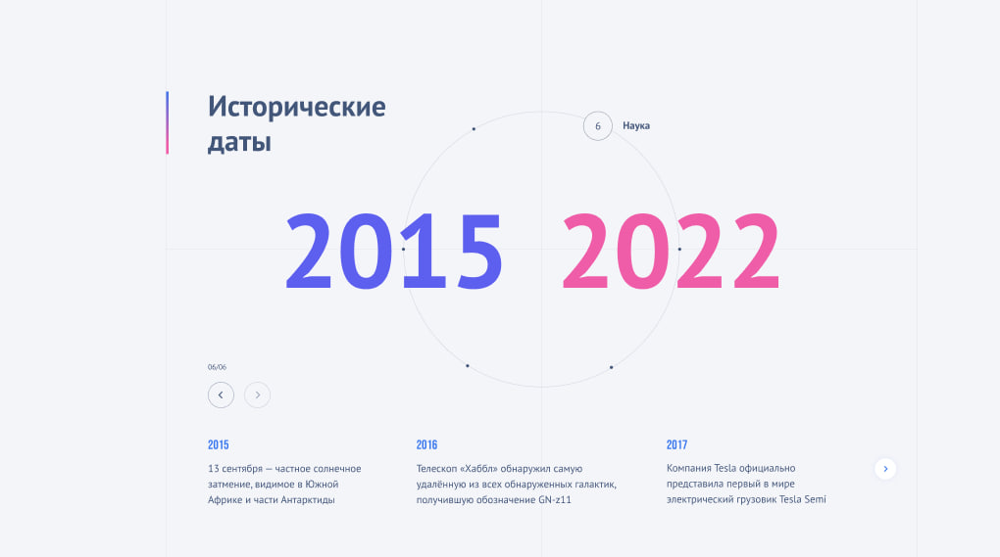

# 📅 Исторические даты

Интерактивный веб-сайт с историческими событиями, сгруппированными по определённым темам.
Основная идея — наглядная навигация по истории с помощью кругового слайдера и синхронизированного контентного слайдера.

---

## 🚀 Функциональность

- 🟠 Круглый слайдер по центру экрана
  - Отображает временные периоды
  - Позволяет переключаться между историческими отрезками
  - Активный период визуально выделяется

- 🔢 Крупные цифры периода
  - Показывают выбранный временной диапазон
  - Меняются синхронно с круговым слайдером

- 📜 Слайдер событий
  - Отображает список исторических событий выбранного периода
  - Автоматически обновляется при смене периода
  - Поддерживает навигацию и свайпы

---

## 🛠 Используемые технологии

- React.js
- SCSS (CSS Modules)
- Swiper.js
- JavaScript (без TypeScript)

---

## 🧩 Архитектура проекта

- Круглый слайдер и слайдер событий связаны через общее состояние
- Swiper используется:
  - для навигации по временным периодам
  - для отображения списка событий
- Компоненты разделены по ответственности:
  - UI-компоненты
  - Логика навигации
  - Стили через SCSS-модули

---

## 📂 Структура проекта

`text
src/
├── components/
│   ├── circle/
│   ├── error/
│   ├── loading/
│   ├── slider/
│   ├── title/
│   └── Block.jsx
│   ├── Block.module.scss
├── App.jsx
└── main.jsx
db.json

## Как всё установить?

Просто напиши в консоль - yarn install